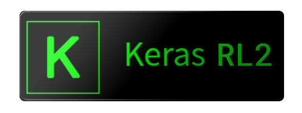

<p align="center">
   
   <br>
   <a>
      
   </a>
   <a>
      
   </a>
   <a href="https://opensource.org/licenses/MIT">
      
   </a>
   <a href="https://opensource.org/licenses/MIT">
      
   </a>
   <a href="http://keras-rl2.readthedocs.io/">
      
   </a> 
   <a href="https://discord.gg/WApky6R">
      
   </a>
   <h3 align="center">Deep Reinforcement Learning for Tensorflow 2 Keras</h3></p>


<table>
  <tr>
    <td></td>
    <td></td>
    <td></td>
  </tr>
</table>

### NOTE: Requires tensorflow==2.0.0


## What is it?

`keras-rl2` implements some state-of-the art deep reinforcement learning algorithms in Python and seamlessly integrates with the deep learning library [Keras](http://keras.io).

Furthermore, `keras-rl2` works with [OpenAI Gym](https://gym.openai.com/) out of the box. This means that evaluating and playing around with different algorithms is easy.

Of course you can extend `keras-rl2` according to your own needs. You can use built-in Keras callbacks and metrics or define your own.
Even more so, it is easy to implement your own environments and even algorithms by simply extending some simple abstract classes. Documentation is available [online](http://keras-rl2.readthedocs.org).


## What is included?
As of today, the following algorithms have been implemented:

- [x] Deep Q Learning (DQN) [[1]](http://arxiv.org/abs/1312.5602), [[2]](https://www.nature.com/articles/nature14236)
- [x] Double DQN [[3]](http://arxiv.org/abs/1509.06461)
- [x] Deep Deterministic Policy Gradient (DDPG) [[4]](http://arxiv.org/abs/1509.02971)
- [x] Continuous DQN (CDQN or NAF) [[6]](http://arxiv.org/abs/1603.00748)
- [x] Cross-Entropy Method (CEM) [[7]](http://learning.mpi-sws.org/mlss2016/slides/2016-MLSS-RL.pdf), [[8]](http://citeseerx.ist.psu.edu/viewdoc/download?doi=10.1.1.81.6579&rep=rep1&type=pdf)
- [x] Dueling network DQN (Dueling DQN) [[9]](https://arxiv.org/abs/1511.06581)
- [x] Deep SARSA [[10]](http://people.inf.elte.hu/lorincz/Files/RL_2006/SuttonBook.pdf)
- [ ] Asynchronous Advantage Actor-Critic (A3C) [[5]](http://arxiv.org/abs/1602.01783)
- [ ] Proximal Policy Optimization Algorithms (PPO) [[11]](https://arxiv.org/abs/1707.06347)

You can find more information on each agent in the [doc](http://keras-rl.readthedocs.io/en/latest/agents/overview/).


## Installation

- Install Keras-RL2 from Pypi (recommended):

```
pip install keras-rl2
```

- Install from Github source:

```
git clone https://github.com/keras-rl2/keras-rl2.git
cd keras-rl
python setup.py install
```

## Examples

If you want to run the examples, you'll also have to install:
- **gym** by OpenAI: [Installation instruction](https://github.com/openai/gym#installation)
- **h5py**: simply run `pip install h5py`

For atari example you will also need:
- **Pillow**: `pip install Pillow`
- **gym[atari]**: Atari module for gym. Use `pip install gym[atari]`

Once you have installed everything, you can try out a simple example:
```bash
python examples/dqn_cartpole.py
```
This is a very simple example and it should converge relatively quickly, so it's a great way to get started!
It also visualizes the game during training, so you can watch it learn. How cool is that?


If you have questions or problems, please file an issue or, even better, fix the problem yourself and submit a pull request!


## References

1. *Playing Atari with Deep Reinforcement Learning*, Mnih et al., 2013
2. *Human-level control through deep reinforcement learning*, Mnih et al., 2015
3. *Deep Reinforcement Learning with Double Q-learning*, van Hasselt et al., 2015
4. *Continuous control with deep reinforcement learning*, Lillicrap et al., 2015
5. *Asynchronous Methods for Deep Reinforcement Learning*, Mnih et al., 2016
6. *Continuous Deep Q-Learning with Model-based Acceleration*, Gu et al., 2016
7. *Learning Tetris Using the Noisy Cross-Entropy Method*, Szita et al., 2006
8. *Deep Reinforcement Learning (MLSS lecture notes)*, Schulman, 2016
9. *Dueling Network Architectures for Deep Reinforcement Learning*, Wang et al., 2016
10. *Reinforcement learning: An introduction*, Sutton and Barto, 2011
11. *Proximal Policy Optimization Algorithms*, Schulman et al., 2017
